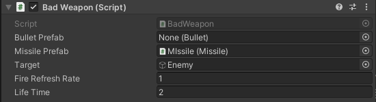
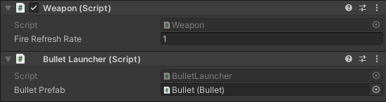

# オープンクローズの原則(OpenClosedPrinciple)

## このリポジトリについて

このリポジトリは、SOLID原則の1つ`オープンクローズの原則(OpenClosedPrinciple)`について、Unityで実践するためにはどのように実装するのかを例にあげて解説しています。

## オープンクローズの原則の概略

この原則は、`ソフトウェアの構成要素は拡張に対しては開いていて、修正に対しては閉じている必要がある`と表現されています。

- 拡張に対して開いている : 拡張ができる
- 修正に対して閉じている : 既存の成果物を変更しない

言い換えると、`既存の成果物は変更せずに、機能を拡張できる状態になっている`ということになります。

## 例 : シューティングゲームで球を発射する処理

以下のコードは、シューティングゲームを作成しているときに弾を発射する場合の処理を書いたものです。

```c#
    /// <summary>
    /// 弾のプレファブ
    /// </summary>
    [SerializeField] private Bullet bulletPrefab;

    /// <summary>
    /// ミサイルのプレファブ
    /// </summary>
    [SerializeField] private Missile missilePrefab;

    /// <summary>
    /// ミサイルのターゲット
    /// </summary>
    [SerializeField] private GameObject target;

    //  途中のコードは省略...

    //  球の生成と発射処理
    private void FireWeapon() {
        if (bulletPrefab != null) {
            //  生成
            Bullet bullet = Instantiate(bulletPrefab);
            //  発射
            bullet.Launch(transform.forward);
        } else if (missilePrefab != null) {
            //  生成
            Missile missile = Instantiate(missilePrefab);
            //  発射
            missile.SetTarget(target);
        }
    }

```

このコードの問題点として、以下の点が思いつきます。

- 発射する弾の選定がPrefabがInspectorで設定されているかに依存している
- Inspectorを見たときに、必然的に空いている項目(None)ができてしまう
  - ぱっと見でどのように設定していいのかわからない
  
- 新しい球の種類を追加する場合、`if文を追加する必要がある(閉じていない)`

  ```c#
  //  球の生成と発射処理
  private void FireWeapon() {
      if (bulletPrefab != null) {
      } else if (missilePrefab != null) {
      } else if(新武器1 != null){
      } else if(新武器2 != null){
      } else if(新武器3 != null){
      } else if(新武器4 != null){
  }
  ```

## 改善するにはどうするか

OpenClosed原則は、最初に説明したように`すでにある機能の変更時`に注目した原則なので、以下の点に注目してコードを改修してみます。

- 新しい武器を追加する
  - `既存のコードを変更せずに追加できるか`(Open)
    - 新武器のPrefab参照を追加する必要があるので
  - `既存のコードを影響(変更)を与えずに変更できるか`(Closed)
    - if文を追加する必要があるので、既存コードに影響を与えている

Unityの場合、GameObjectにアタッチしているスクリプトを付け替えるだけで、武器を変更できるようにすると、コードの変更をせずに武器を変更できるといえるかと思います。

- 本来は、DIなどの処理を使う必要がありますが、今回は省略します。

つまり、武器を発射する処理のみを記述し、それがどの武器かを`FireWeaponメソッド`が知らなければいいということになります。

### 修正したコード

- 発射物を管理するクラスが実装するInterfaceです。
- Weaponクラスは、このInterfaceだけを頼りに処理をします。

```c#
/// <summary>
/// 発射インターフェイス
/// </summary>
internal interface ILauncher
{
    /// <summary>
    /// 発射
    /// </summary>
    void Launch();
}
```

- Bulletクラスの処理については、記述していませんが、処理としては、弾丸そのものの動きを記述しています。
- BulletLauncherクラスは、ILauncherを実装しているので、発射物の管理(生成,消去)までを担当します。

```c#
/// <summary>
/// 弾を生成、発射、消去する
/// </summary>
public class BulletLauncher : MonoBehaviour, ILauncher
{
    [SerializeField] private Bullet bulletPrefab;

    [SerializeField] private float lifeTime = 2f;

    /// <summary>
    /// 弾丸を発射する
    /// </summary>
    /// <param name="weapon"></param>
    public void Launch(GoodWeapon weapon) {
        Bullet bullet = Instantiate(bulletPrefab);

        bullet.Launch(weapon.transform.forward);
    }
}
```

- このクラスが球を発射する

```c#
public class Weapon() : MonoBehaviour{
  /// <summary>
  /// 発射する武器
  /// InterfaceはInspectorから渡せないので、Awakeで拾ってくる必要がある
  /// </summary>
  private ILauncher launcher;

  private void Awake() {
      //  同じゲームオブジェクトについているILauncherを実装したクラスを取得
      launcher = GetComponent<ILauncher>();
      if(launcher == null) {
          Debug.LogError("ILauncherを実装したクラスを取得できませんでした。");
      }
  }

  //  球の生成と発射処理
  private void FireWeapon() {
    launcher.Launch();
  }

  private void Update(){
    FireWeapon();
  }
}
```

これらのクラス2つを同じゲームオブジェクトにつけることで、球を発射し続ける処理を追加できます。

;

このような設計にしておくことで、新しい武器を追加する場合、`ILauncherインターフェイス`を実装したクラスを作成し、Weaponクラスと同じオブジェクトにアタッチするだけで、発射方法は変えずに武器を切り替えられるようになります。
